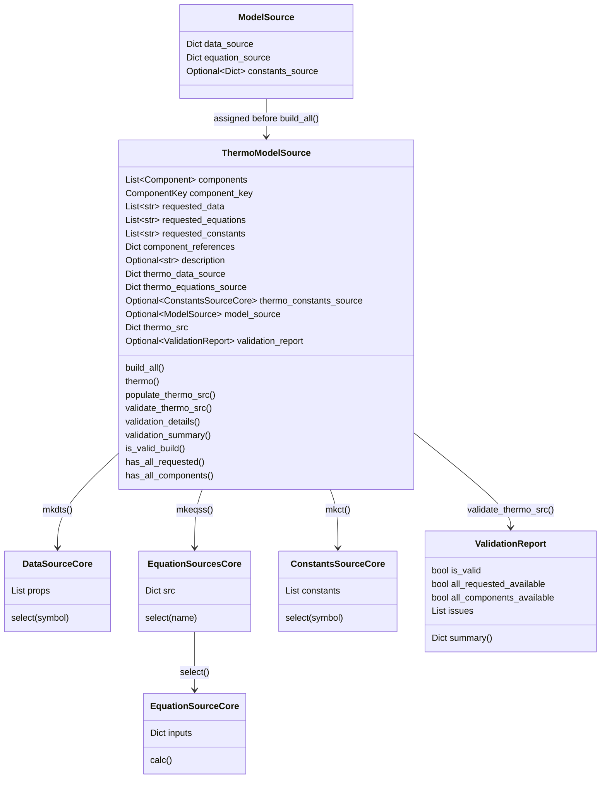
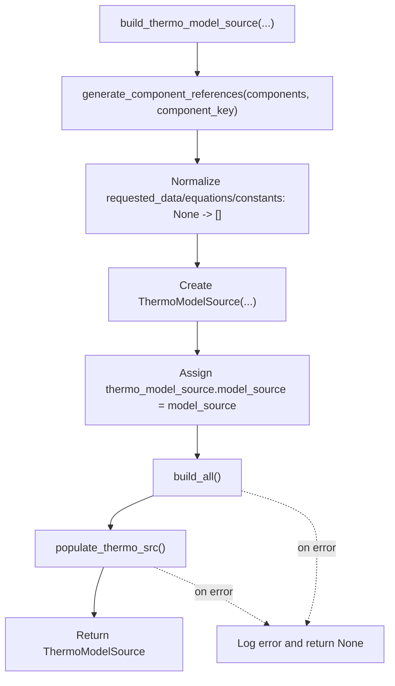
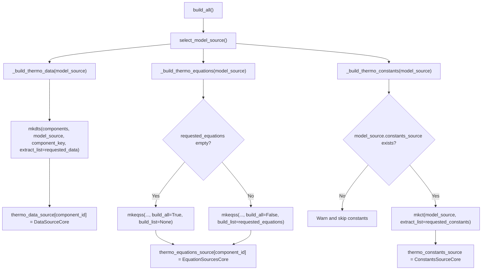
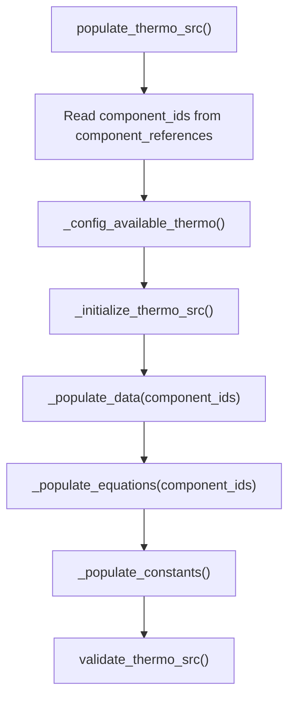
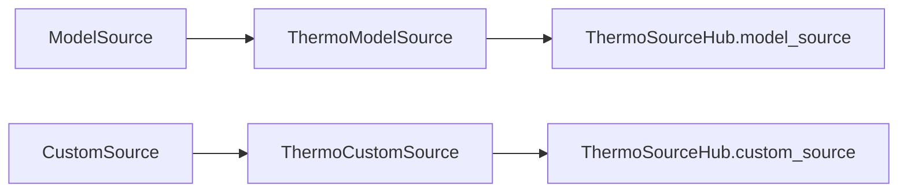

# `ThermoModelSource` guidance

`pyThermoLinkDB.builders.thermo_model_source.ThermoModelSource` converts a
structured `ModelSource` into a runtime-friendly thermodynamic source map.
It is usually built through `build_thermo_model_source()` rather than by direct
class construction.

Use this class when you already have a `ModelSource` and want a normalized
symbol-indexed object that can provide:

- component-wise data values,
- component-wise equation sources,
- source-level constants,
- validation details for requested symbols and component coverage.

## Recommended Entry Point

```python
from pyThermoLinkDB.builders import build_thermo_model_source

thermo_model_src = build_thermo_model_source(
    model_source=model_source,
    components=components,
    component_key="Name-State",
    requested_data=["EnFo_IG", "Tc", "Pc"],
    requested_equations=["Cp_IG", "VaPr"],
    requested_constants=["R", "dH_rxn"],
    description="Example thermo model source",
)
```

If `requested_data`, `requested_equations`, or `requested_constants` are
omitted or set to `None`, the factory normalizes them to empty lists. Empty
lists mean "discover all available symbols" during population.

## Object Shape



## Factory Flow

`build_thermo_model_source()` in `pyThermoLinkDB/builders/main.py` is the
normal construction path.



## Internal Build Flow

`build_all()` selects the assigned `ModelSource`, then builds the three source
families.



## Canonical `thermo_src` Entry

`populate_thermo_src()` creates a fixed-shape entry for each requested or
discovered symbol.

```python
thermo_model_src.thermo_src["Tc"] == {
    "src": {...},      # source object or component source mapping
    "comp": {...},     # component_id -> numeric value for component-wise data
    "value": array,    # numpy array for component-wise data, scalar/list/dict for constants
    "eq": None,        # component_id -> EquationSourceCore for equations
    "mode": ["data"],  # one or more of: data, equation, constants
}
```

The fixed keys are always:

- `src`
- `comp`
- `value`
- `eq`
- `mode`

`mode` records where the symbol came from. A symbol can have more than one
mode when it appears in multiple requested lists or when constants provide
component-wise values for a data or equation symbol.

## Population Flow



### `_config_available_thermo()`

When any requested list is empty, this method fills it from already built
source objects:

- empty `requested_data` becomes the union of `DataSourceCore.props`,
- empty `requested_equations` becomes the union of `EquationSourcesCore.src`,
- empty `requested_constants` becomes `ConstantsSourceCore.constants`.

This is why omitting request lists in `build_thermo_model_source()` builds a
source for all available model-source symbols.

### `_initialize_thermo_src()`

Creates one entry per unique symbol across requested data, equations, and
constants. Each entry starts as:

```python
{
    "src": None,
    "comp": None,
    "value": None,
    "eq": None,
    "mode": ["data", "equation", "constants"],
}
```

The initial `mode` list contains the request categories that include the
symbol.

### `_populate_data(component_ids)`

For every requested data symbol:

1. Looks up each component's `DataSourceCore`.
2. Calls `DataSourceCore.select(symbol=symbol)`.
3. Stores the selected `CustomProperty` by component id in `src`.
4. Stores numeric component values in `comp`.
5. Stores a `numpy.ndarray` of values in `value`.
6. Adds `data` to `mode`.

Result shape:

```python
thermo_src["Tc"] = {
    "src": {"carbon dioxide-g": CustomProperty(...), ...},
    "comp": {"carbon dioxide-g": 304.2, ...},
    "value": np.array([304.2, ...]),
    "eq": None,
    "mode": ["data"],
}
```

### `_populate_equations(component_ids)`

For every requested equation symbol:

1. Looks up each component's `EquationSourcesCore`.
2. Calls `EquationSourcesCore.select(name=symbol)`.
3. Stores selected `EquationSourceCore` objects in `eq`.
4. Adds `equation` to `mode`.

The equation source can later be executed with validated runtime inputs:

```python
eq_sources = thermo_model_src.thermo_src["Cp_IG"]["eq"]
equation_source = eq_sources["carbon dioxide-g"]
result = equation_source.calc(**input_args)
```

### `_populate_constants()`

For every requested constant symbol:

1. Calls `ConstantsSourceCore.select(symbol=symbol)`.
2. Stores the selected `CustomConstant` in `src`.
3. Stores `CustomConstant.value` in `value`.
4. Adds `constants` to `mode`.

Special handling exists for component-wise constants:

- If a constant value is a dictionary keyed by every component id, it can be
  converted into `comp` and `value`.
- If that symbol was requested as data, the constant supplies data-like
  component values.
- If that symbol was requested as an equation, the existing equation source is
  preserved and the component-wise constant values are added.
- If a constant conflicts with an equation symbol and is not component-wise,
  it is removed from `requested_constants` after being consumed as a conflict.

## Method Reference

| Method | Role |
| --- | --- |
| `model_source` | Property storing the assigned `ModelSource`. |
| `select_model_source()` | Returns `model_source` or raises if missing. |
| `build_all()` | Builds data, equation, and constants source cores. |
| `thermo()` | Returns requested symbol lists grouped as data/equations/constants. |
| `populate_thermo_src()` | Discovers symbols, initializes `thermo_src`, populates entries, validates. |
| `validate_thermo_src()` | Runs `ThermoSourceValidator` and stores `validation_report`. |
| `validation_details()` | Returns the latest `ValidationReport`. |
| `validation_summary()` | Returns `validation_report.summary()` or `None`. |
| `is_valid_build()` | True when validation exists and has no error-level issues. |
| `has_all_requested()` | True when every requested symbol has a usable entry. |
| `has_all_components()` | True when component-wise data/equations cover all components. |

Internal helpers:

| Method | Role |
| --- | --- |
| `_build_thermo_data()` | Calls `mkdts()` and fills `thermo_data_source`. |
| `_build_thermo_equations()` | Calls `mkeqss()` and fills `thermo_equations_source`. |
| `_build_thermo_constants()` | Calls `mkct()` and fills `thermo_constants_source`. |
| `_config_available_thermo()` | Replaces empty requested lists with discovered symbols. |
| `_initialize_thermo_src()` | Creates fixed-shape symbol entries. |
| `_symbol_modes()` | Computes initial modes for a symbol. |
| `_add_symbol_mode()` | Adds a mode without duplicates. |
| `_populate_data()` | Populates component data values and source objects. |
| `_populate_equations()` | Populates component equation source objects. |
| `_component_constant_values()` | Detects component-wise numeric constants. |
| `_populate_constants()` | Populates constants and handles symbol conflicts. |

## Validation

Validation is non-raising. `validate_thermo_src()` stores a
`ValidationReport`, and the convenience methods read from it.

```python
thermo_model_src.validation_summary()
thermo_model_src.is_valid_build()
thermo_model_src.has_all_requested()
thermo_model_src.has_all_components()
```

The validator checks:

- every symbol entry has the fixed keys,
- requested symbols exist in `thermo_src`,
- requested data has `src`, `comp`, and `value`,
- requested equations have component equation sources,
- requested constants have `src` and `value`,
- component dictionaries align with value lengths,
- component-wise values are finite numbers.

## Runtime Equation Calculation

`ThermoModelSource` does not itself validate runtime equation inputs. The
examples use `validate_and_build_inputs()` before calling `EquationSourceCore`.

```python
from pyThermoLinkDB.utils.input_builder import validate_and_build_inputs

runtime_inputs = {
    "T": {"value": 25.0, "unit": "C"},
    "P": {"value": 101325.0, "unit": "Pa"},
}

eq_sources = thermo_model_src.thermo_src["Cp_IG"]["eq"] or {}

for component_id, equation_source in eq_sources.items():
    input_args = validate_and_build_inputs(
        equation_source.inputs,
        runtime_inputs,
        unit_conversion_fn=unit_conversion_fn,
        unit_availability_fn=unit_availability_fn,
    )
    result = equation_source.calc(**input_args)
```

## Usage Patterns

### Build selected symbols

```python
thermo_model_src = build_thermo_model_source(
    model_source=model_source,
    components=components,
    component_key="Name-State",
    requested_data=["EnFo_IG", "Tc", "Pc"],
    requested_equations=["Cp_IG", "VaPr"],
    requested_constants=["R", "dH_rxn"],
)
```

### Build all available symbols

```python
thermo_model_src = build_thermo_model_source(
    model_source=model_source,
    components=components,
    component_key="Name-State",
)
```

### Read component-wise data

```python
tc_entry = thermo_model_src.thermo_src["Tc"]
tc_values = tc_entry["value"]
tc_by_component = tc_entry["comp"]
tc_sources = tc_entry["src"]
```

### Read component-wise equations

```python
cp_entry = thermo_model_src.thermo_src["Cp_IG"]
cp_equations = cp_entry["eq"]
```

### Read constants

```python
r_entry = thermo_model_src.thermo_src["R"]
r_value = r_entry["value"]
r_source = r_entry["src"]
```

## Relationship To `ThermoSourceHub`

`ThermoModelSource` only represents the model-source side. When a workflow also
uses custom sources, `build_thermo_source_hub()` places this object under the
`model_source` group and a `ThermoCustomSource` under the `custom_source` group.


