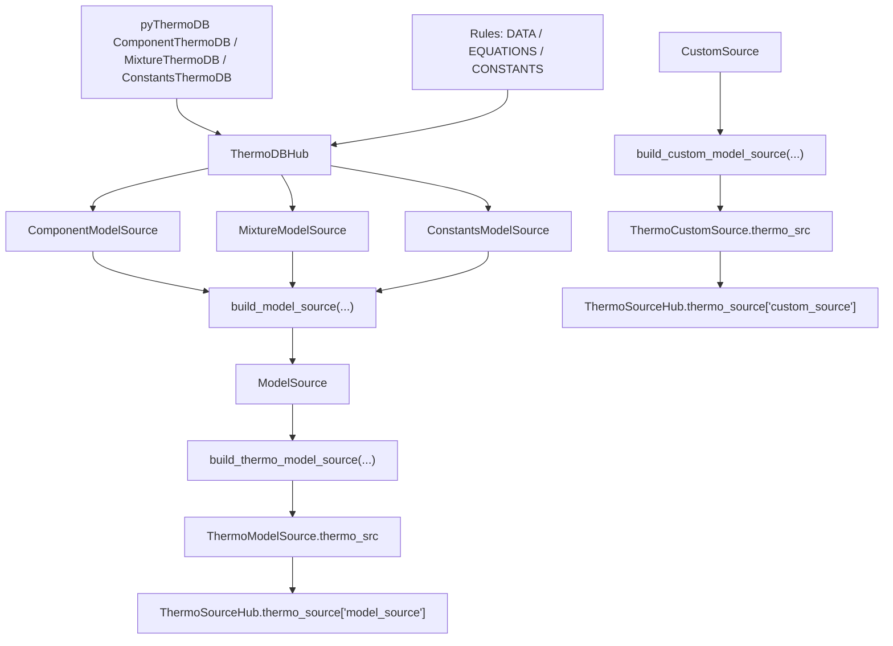
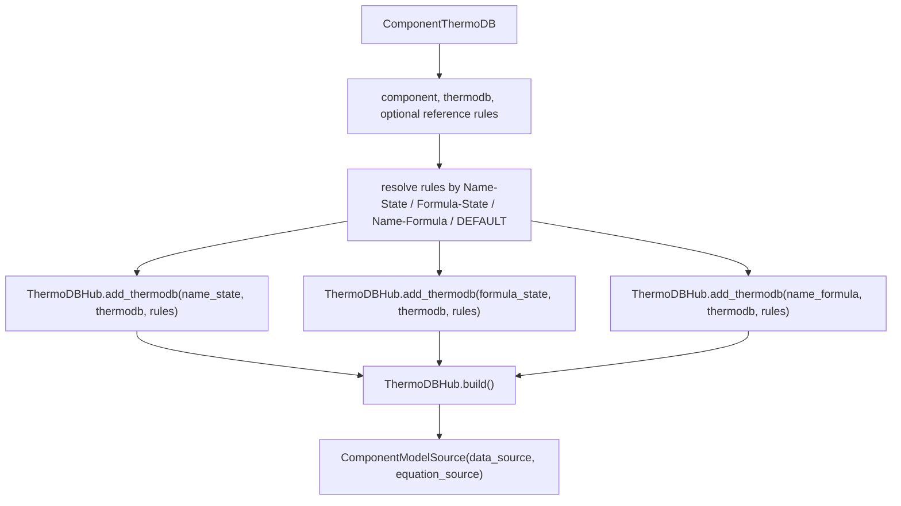
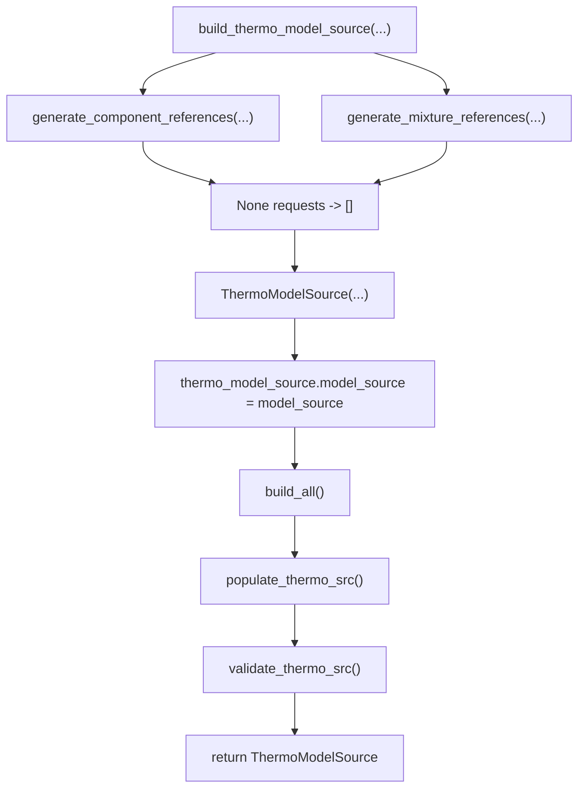
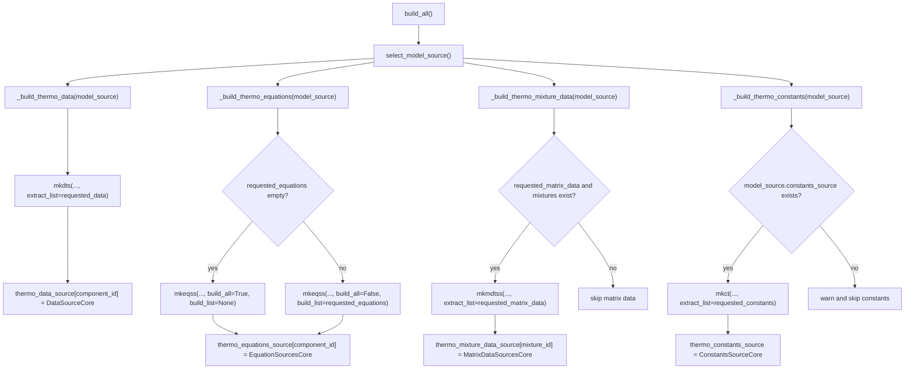

# `ThermoModelSource`, `ModelSource`, and `ThermoSourceHub`

This note describes how the builder layer turns raw `pyThermoDB` records into a
runtime thermodynamic source map.

There are four related layers:

1. `ThermoDBHub` links raw thermodb records to source symbols by using rules.
2. `ComponentModelSource`, `MixtureModelSource`, and `ConstantsModelSource`
   hold per-record build results.
3. `ModelSource` merges those build results into one structured source.
4. `ThermoModelSource` and `ThermoSourceHub` expose the selected runtime data,
   equations, matrix data, and constants through fixed-shape entries.

## End-to-End Relation



## Section 1: `ThermoDBHub`

`pyThermoLinkDB.app.init()` creates a `pyThermoLinkDB.docs.ThermoDBHub`.
The application builders use this hub as a temporary linker for one thermodb
record or one constants group.

Important methods:

| Method | Role |
| --- | --- |
| `add_thermodb(name, data, rules)` | Registers a `pyThermoDB.CompBuilder` under a source id and optional rules. |
| `build()` | Builds component or mixture `datasource` and `equationsource` dictionaries. |
| `_build_cte_src()` | Builds constants from the registered `"Constants"` record. |
| `build_model_source()` | Builds and wraps data/equations in a `ModelSource`. |
| `check()` | Returns a summary of the hub's built data/equation entries. |

Rules define how labels in thermodb are renamed into runtime symbols:

```python
rules = {
    "DATA": {
        "critical-temperature": "Tc",
        "critical-pressure": "Pc",
    },
    "EQUATIONS": {
        "CUSTOM-REF-1::ideal-gas-heat-capacity": "Cp_IG",
        "CUSTOM-REF-1::vapor-pressure": "VaPr",
    },
}
```

Example output shape after `thermodb_hub.build()`:

```python
datasource.keys()
# output:
# dict_keys(["carbon dioxide-g"])

datasource["carbon dioxide-g"].keys()
# output:
# dict_keys(["Tc", "Pc"])

equationsource["carbon dioxide-g"].keys()
# output:
# dict_keys(["Cp_IG", "VaPr"])
```

The hub is not the final runtime access object. It is a linker used by
`build_component_model_source()`, `build_mixture_model_source()`, and
`build_constants_model_source()`.

## Section 2: Per-Record Model Sources

### Component Model Source

`build_component_model_source()` accepts one `ComponentThermoDB`.
It registers the same thermodb under several component ids:

- `Name-State`
- `Formula-State`
- `Name-Formula`

This lets later runtime builders match the same source using different
`component_key` values.



Example output shape:

```python
component_model_source.data_source.keys()
# output:
# dict_keys(["carbon dioxide-g", "CO2-g", "carbon dioxide-CO2"])

component_model_source.equation_source["carbon dioxide-g"].keys()
# output:
# dict_keys(["Cp_IG", "VaPr"])
```

### Mixture Model Source

`build_mixture_model_source()` works similarly, but the record ids are mixture
ids generated from `mixture_keys`, usually `"Name"` and `"Formula"`.

Matrix data such as binary interaction parameters is stored in
`data_source`; equations are stored in `equation_source`.

Example output shape:

```python
mixture_model_source.data_source.keys()
# output:
# dict_keys(["methanol|ethanol", "CH3OH|C2H5OH"])

mixture_model_source.data_source["methanol|ethanol"].keys()
# output:
# dict_keys(["alpha", "tau"])
```

### Constants Model Source

`build_constants_model_source()` registers one constants thermodb under
`"Constants"` and calls `ThermoDBHub._build_cte_src()`.

Example output shape:

```python
constants_model_source.constants_source.keys()
# output:
# dict_keys(["R", "dH_rxn"])
```

## Section 3: Aggregated `ModelSource`

`build_model_source(source=[...])` merges per-record model sources:

- `ComponentModelSource` and `MixtureModelSource` update
  `model_source.data_source` and `model_source.equation_source`.
- `ConstantsModelSource` updates `model_source.constants_source`.
- `ThermoUtils` extracts symbol metadata into `data_symbols`,
  `equation_symbols`, and `constants_symbols`.

```python
from pyThermoLinkDB import build_model_source

model_source = build_model_source([
    co2_component_model_source,
    methanol_ethanol_mixture_model_source,
    constants_model_source,
])
```

Example output:

```python
model_source.model_dump().keys()
# output:
# dict_keys([
#     "data_source",
#     "equation_source",
#     "constants_source",
#     "data_symbols",
#     "equation_symbols",
#     "constants_symbols",
# ])

model_source.data_source.keys()
# output:
# dict_keys([
#     "carbon dioxide-g",
#     "CO2-g",
#     "carbon dioxide-CO2",
#     "methanol|ethanol",
#     "CH3OH|C2H5OH",
# ])
```

`load_and_build_model_source()` performs the same aggregation after loading
component and mixture thermodb files. In the current implementation, when it
combines component and mixture model sources directly, it merges data and
equation dictionaries; constants are provided through the explicit constants
builder path.

## Section 4: Runtime `ThermoModelSource`

`build_thermo_model_source()` converts a `ModelSource` into a
`ThermoModelSource`, which is the runtime object used for symbol-based access.

```python
from pyThermoLinkDB.builders import build_thermo_model_source

thermo_model_source = build_thermo_model_source(
    components=components,
    component_key="Name-State",
    mixtures=mixtures,
    mixture_key="Name",
    model_source=model_source,
    requested_data=["Tc", "Pc"],
    requested_equations=["Cp_IG", "VaPr"],
    requested_matrix_data=["alpha", "tau"],
    requested_constants=["R"],
)
```

Factory flow:



`None` and `[]` have a useful meaning. The factory normalizes `None` to `[]`,
and then `ThermoModelSource._config_available_thermo()` fills empty request
lists from whatever was built:

- data symbols from `DataSourceCore.props`,
- equation symbols from `EquationSourcesCore.src`,
- matrix-data symbols from `MatrixDataSourcesCore.props`,
- constants from `ConstantsSourceCore.constants`.

So omitting a request list means "discover all available symbols" after the
core source objects are built.

## Section 5: Internal Runtime Build

`ThermoModelSource.build_all()` selects the assigned `ModelSource` and builds
four source families.



## Section 6: Canonical `thermo_src`

`populate_thermo_src()` creates one fixed-shape entry for every requested or
discovered symbol.

Every entry has the same keys:

```python
{
    "src": None,
    "comp": None,
    "value": None,
    "eq": None,
    "mode": ["data"],  # data, equation, matrix_data, constants
}
```

### Data Entry

Component data fills `src`, `comp`, and `value`.

```python
thermo_model_source.thermo_src["Tc"]
# output:
# {
#     "src": {
#         "carbon dioxide-g": CustomProperty(...),
#         "methanol-l": CustomProperty(...),
#     },
#     "comp": {
#         "carbon dioxide-g": 304.2,
#         "methanol-l": 512.6,
#     },
#     "value": array([304.2, 512.6]),
#     "eq": None,
#     "mode": ["data"],
# }
```

### Equation Entry

Equation symbols fill `eq` with component-keyed `EquationSourceCore` objects.

```python
thermo_model_source.thermo_src["Cp_IG"]
# output:
# {
#     "src": None,
#     "comp": None,
#     "value": None,
#     "eq": {
#         "carbon dioxide-g": EquationSourceCore(...),
#         "methanol-l": EquationSourceCore(...),
#     },
#     "mode": ["equation"],
# }
```

Equation calculation happens on the selected `EquationSourceCore`, not directly
on `ThermoModelSource`:

```python
eq_source = thermo_model_source.thermo_src["Cp_IG"]["eq"]["carbon dioxide-g"]
eq_source.calc(T=298.15)
# output:
# EquationResult(value=37.13, unit="J/mol.K", symbol="Cp_IG")
```

### Matrix-Data Entry

Matrix data uses mixture ids instead of component ids. The model runtime keeps
the selected matrix source objects in `src`.

```python
thermo_model_source.thermo_src["alpha"]
# output:
# {
#     "src": {
#         "methanol|ethanol": MatrixDataSourceCore(...),
#     },
#     "comp": None,
#     "value": None,
#     "eq": None,
#     "mode": ["matrix_data"],
# }
```

### Constant Entry

Constants fill `src` and `value`.

```python
thermo_model_source.thermo_src["R"]
# output:
# {
#     "src": CustomConstant(value=8.31446261815324, unit="J/mol.K", symbol="R"),
#     "comp": None,
#     "value": 8.31446261815324,
#     "eq": None,
#     "mode": ["constants"],
# }
```

Component-wise constants are special. If a constant value is a dictionary keyed
by all component ids, it can also populate `comp` and vector `value`.

```python
thermo_model_source.thermo_src["MW"]
# output:
# {
#     "src": CustomConstant(...),
#     "comp": {
#         "carbon dioxide-g": 44.01,
#         "methanol-l": 32.04,
#     },
#     "value": array([44.01, 32.04]),
#     "eq": None,
#     "mode": ["data", "constants"],
# }
```

If the same symbol is requested as an equation and as a component-wise constant,
the equation source is preserved and the constant contributes `comp` and
`value`.

## Section 7: Validation

`validate_thermo_src()` is non-raising. It stores a `ValidationReport` on the
source.

```python
thermo_model_source.validation_summary()
# output:
# {
#     "is_valid": True,
#     "all_requested_available": True,
#     "all_components_available": True,
#     "error_count": 0,
#     "warning_count": 0,
#     "missing_requested": [],
#     "missing_data": {},
#     "missing_equations": {},
#     "missing_matrix_data": [],
#     "missing_constants": [],
# }

thermo_model_source.is_valid_build()
# output:
# True
```

The validator checks that:

- every symbol has the fixed `src`, `comp`, `value`, `eq`, and `mode` keys,
- requested symbols exist in `thermo_src`,
- component data has source objects, component values, and a value vector,
- equations have component-keyed equation sources,
- constants have source objects and values,
- component-value mappings align with value vector length,
- numeric component values are finite.

## Section 8: Combined `ThermoSourceHub`

`build_thermo_source_hub()` builds optional model and custom runtime sources
and places them under two source groups.

```python
from pyThermoLinkDB.builders import build_thermo_source_hub
from pyThermoLinkDB.models import ModelSourceConfig, CustomSourceConfig

hub = build_thermo_source_hub(
    components=components,
    component_key="Name-State",
    mixtures=mixtures,
    mixture_key="Name",
    model_source=model_source,
    custom_source=custom_source,
    model_source_config=ModelSourceConfig(
        data=["Tc", "Pc"],
        equations=["Cp_IG"],
        matrix_data=["alpha"],
        constants=["R"],
    ),
    custom_source_config=CustomSourceConfig(
        data=["MW"],
        constants=["R_custom"],
    ),
)
```

Hub shape:

```python
hub.thermo_source.keys()
# output:
# dict_keys(["model_source", "custom_source"])

hub.thermo_source["model_source"].keys()
# output:
# dict_keys(["Tc", "Pc", "Cp_IG", "alpha", "R"])

hub.thermo_source["custom_source"].keys()
# output:
# dict_keys(["MW", "R_custom"])
```

The hub delegates symbol access to `ThermoSourceExtractor`.

```python
hub.get_model_source_symbols()
# output:
# ["Tc", "Pc", "Cp_IG", "alpha", "R"]

hub.get_model_source_symbol_modes()
# output:
# {
#     "Tc": ["data"],
#     "Pc": ["data"],
#     "Cp_IG": ["equation"],
#     "alpha": ["matrix_data"],
#     "R": ["constants"],
# }

hub.get_comp_dt("model_source", "Tc")
# output:
# {"carbon dioxide-g": 304.2, "methanol-l": 512.6}

hub.get_comp_values("model_source", "Tc")
# output:
# array([304.2, 512.6])

hub.get_comp_eq("model_source", "Cp_IG")
# output:
# {"carbon dioxide-g": EquationSourceCore(...), "methanol-l": EquationSourceCore(...)}

hub.get_matrix_data_src("model_source", "alpha")
# output:
# {"methanol|ethanol": MatrixDataSourceCore(...)}

hub.get_const("model_source", "R")
# output:
# 8.31446261815324
```

When a component list is passed to accessors, component-keyed entries are
returned in that component order. Matrix-data accessors use mixture ids
generated from `mixture_key`.

```python
hub.get_matrix_data_src(
    "model_source",
    "alpha",
    components=[methanol, ethanol],
)
# output when mixture_key="Formula":
# {"CH3OH|C2H5OH": MatrixDataSourceCore(...)}
```

## Section 9: Registry Selection

`ThermoSourceHub.register_thermo_source()` resolves a
`ThermoSourceHubConfig` into a compact registry. This lets each symbol choose
where property data, equations, constants, or matrix data should come from.

```python
registry = hub.register_thermo_source(config, components=components)

registry
# output:
# {
#     "Tc": {
#         "src": {"carbon dioxide-g": CustomProperty(...), "methanol-l": CustomProperty(...)},
#     },
#     "Cp_IG": {
#         "eq": {"carbon dioxide-g": EquationSourceCore(...), "methanol-l": EquationSourceCore(...)},
#     },
#     "R": {
#         "src": CustomConstant(...),
#     },
#     "alpha": {
#         "src": {"methanol|ethanol": MatrixDataSourceCore(...)},
#     },
# }
```

The registry does not modify the source hub. It is a configured extraction
view over the already built `thermo_source`.

## Practical Mental Model

- Use `ThermoDBHub` to map raw thermodb labels to desired symbols.
- Use `build_component_model_source()`, `build_mixture_model_source()`, and
  `build_constants_model_source()` to create per-record source containers.
- Use `build_model_source()` to merge those containers into one `ModelSource`.
- Use `build_thermo_model_source()` to turn a `ModelSource` into fixed-shape
  runtime entries.
- Use `build_thermo_source_hub()` when model and custom sources must be
  available through one access layer.
