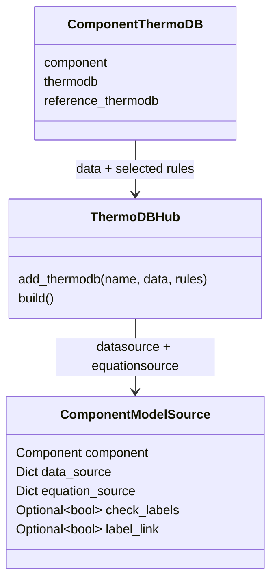

# `build_component_model_source` flow

```mermaid
flowchart TD
    A["Call build_component_model_source(component_thermodb, rules=None, check_labels=True, overwrite_rules=False, verbose=False)"] --> B["Initialize ThermoDBHub via init()"]
    B --> C["Extract from component_thermodb"]
    C --> C1["component = component_thermodb.component"]
    C --> C2["thermodb = component_thermodb.thermodb"]
    C --> C3["reference_thermodb = component_thermodb.reference_thermodb"]

    C3 --> D{"reference_thermodb exists?"}
    D -->|Yes| E["Load reference configs, rules, labels, ignore_labels, ignore_props"]
    D -->|No| F["Use empty reference configs/rules/labels/ignore lists"]
    E --> G["Build component IDs"]
    F --> G

    G --> G1["name_state = set_component_key(component, 'Name-State')"]
    G --> G2["formula_state = set_component_key(component, 'Formula-State')"]
    G --> G3["name_formula = set_component_key(component, 'Name-Formula')"]
    G1 --> H["Initialize component_rules_dict for all 3 IDs with reference_rules"]
    G2 --> H
    G3 --> H

    H --> I{"rules argument provided?"}
    I -->|No| J["Use reference rules only"]
    J --> J1["label_link = False"]

    I -->|Yes| K{"overwrite_rules?"}
    K -->|Yes| K1["Reset component_rules_dict for all 3 IDs to empty dicts"]
    K -->|No| L["Keep reference rules as fallback"]
    K1 --> M["Load/validate rules"]
    L --> M

    M --> M1{"rules is string?"}
    M1 -->|Yes| M2["rules = create_rules_from_str(rules)"]
    M1 -->|No| M3{"rules is dict?"}
    M3 -->|No| M4["Raise ValueError"]
    M3 -->|Yes| N["Look up component-specific rules"]
    M2 --> N

    N --> N1["Search by Name-State"]
    N --> N2["Search by Formula-State"]
    N --> N3["Search by Name-Formula"]
    N1 --> O["Store found rules in component_rules_dict"]
    N2 --> O
    N3 --> O

    O --> P{"No rules found for any ID?"}
    P -->|Yes| P1["Look up default rules using DEFAULT_RULES_KEY"]
    P1 --> P2{"default rules found?"}
    P2 -->|Yes| P3["Apply default rules to all 3 IDs"]
    P2 -->|No| P4["Log warning: no rules found"]
    P -->|No| Q["Extract labels from selected rules"]
    P3 --> Q
    P4 --> Q

    Q --> R["Combine unique rule labels"]
    R --> S["label_link = True"]
    S --> T{"check_labels and reference labels and rule labels?"}
    T -->|No| U["Skip label validation"]
    T -->|Yes| V["For each rule label, verify it exists in reference labels"]
    V --> W{"missing label?"}
    W -->|Yes| W1["label_link = False; log error"]
    W -->|No| U
    W1 --> U

    J1 --> X["Choose rule_ from name_state, formula_state, or name_formula"]
    U --> X
    X --> Y{"rule_ empty or missing?"}
    Y -->|Yes| Y1["rule_ = None"]
    Y -->|No| Z["Keep selected rule_"]
    Y1 --> AA["Add thermodb to hub three times"]
    Z --> AA

    AA --> AA1["thermodb_hub.add_thermodb(name_state, thermodb, rule_)"]
    AA --> AA2["thermodb_hub.add_thermodb(formula_state, thermodb, rule_)"]
    AA --> AA3["thermodb_hub.add_thermodb(name_formula, thermodb, rule_)"]

    AA1 --> AB["datasource, equationsource = thermodb_hub.build()"]
    AA2 --> AB
    AA3 --> AB

    AB --> AC["Create ComponentModelSource"]
    AC --> AC1["component = component"]
    AC --> AC2["data_source = datasource"]
    AC --> AC3["equation_source = equationsource"]
    AC --> AC4["check_labels = check_labels"]
    AC --> AC5["label_link = label_link"]
    AC1 --> AD["Return component_model_source"]
    AC2 --> AD
    AC3 --> AD
    AC4 --> AD
    AC5 --> AD

    B -. on error .-> ERR["Log and raise wrapped Exception"]
    M2 -. on error .-> ERR
    AD -. outer try success .-> DONE["Done"]
```

## Output shape

```mermaid
classDiagram
    class ComponentThermoDB {
        component
        thermodb
        reference_thermodb
    }

    class ComponentModelSource {
        Component component
        Dict data_source
        Dict equation_source
        Optional~bool~ check_labels
        Optional~bool~ label_link
    }

    class ThermoDBHub {
        add_thermodb(name, data, rules)
        build()
    }

    ComponentThermoDB --> ThermoDBHub : data + selected rules
    ThermoDBHub --> ComponentModelSource : datasource + equationsource
```
