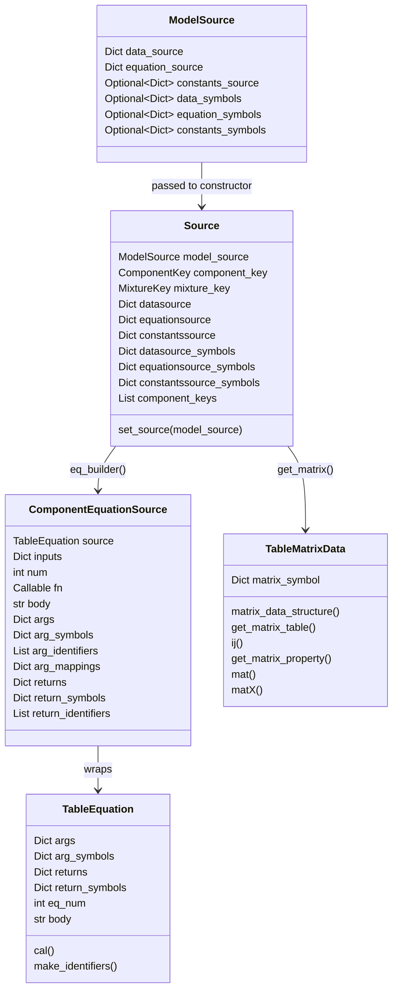
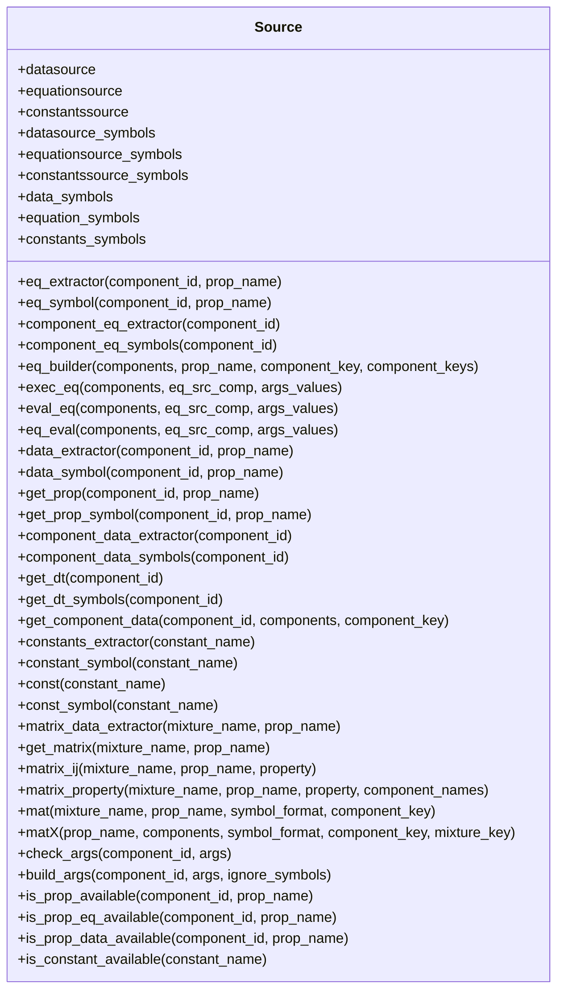
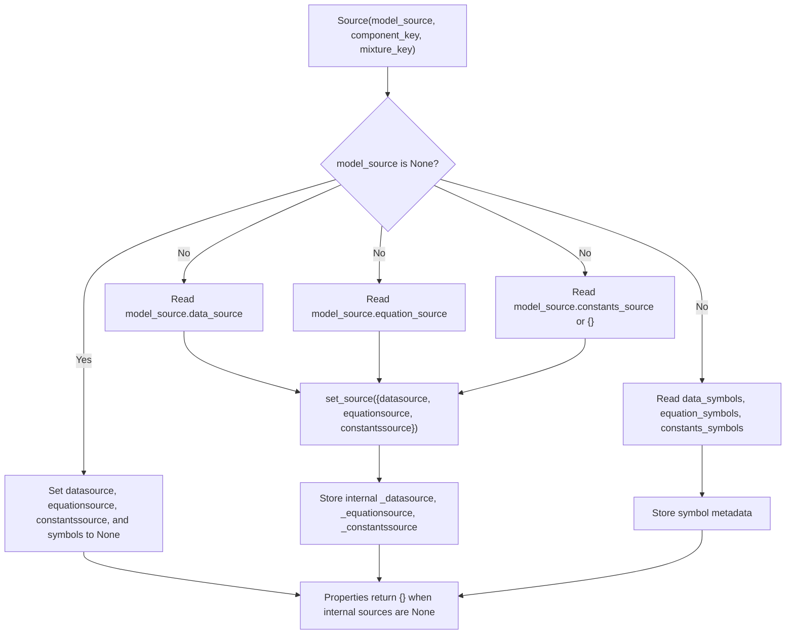
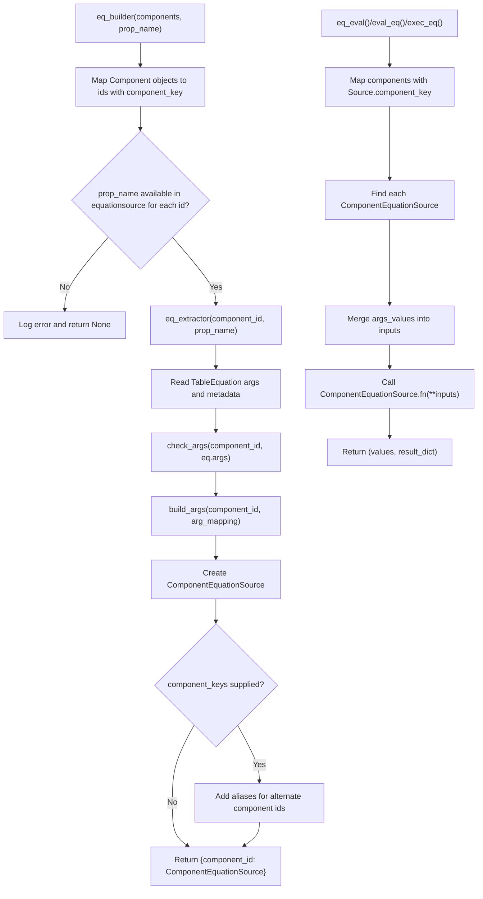
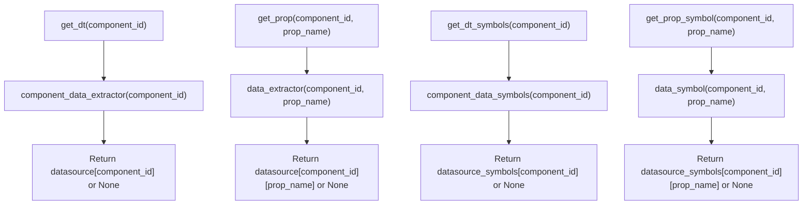
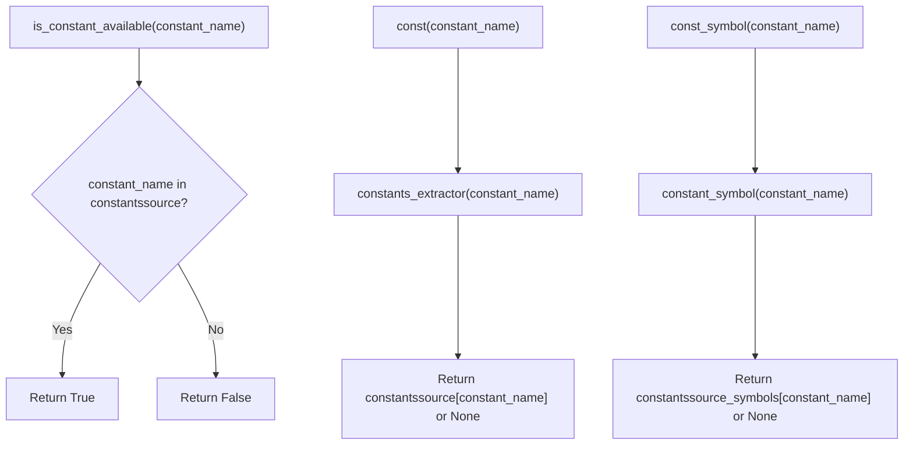
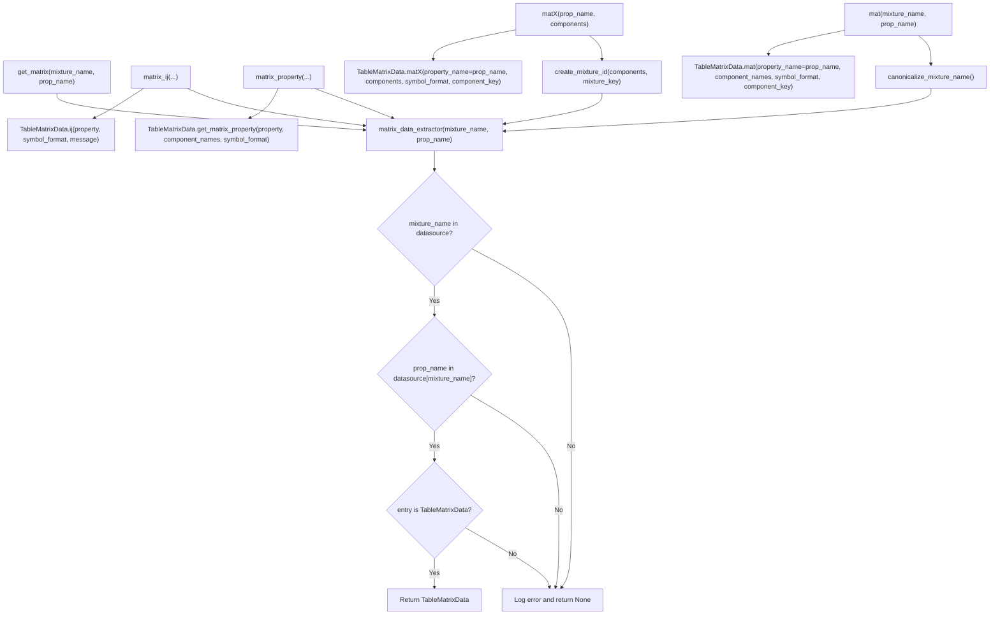
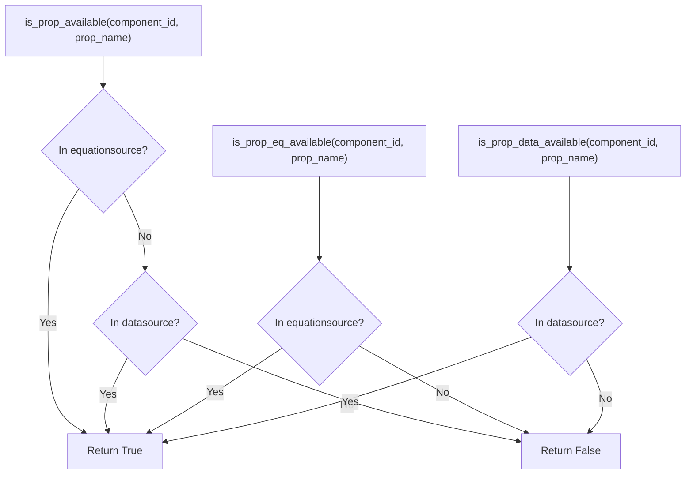
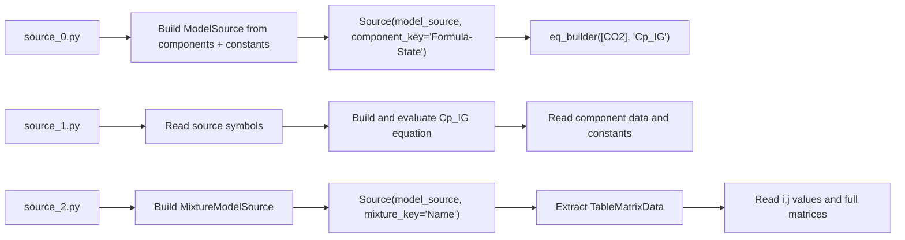

# `Source` class

`pyThermoLinkDB.thermo.Source` is the runtime access layer around a
`ModelSource`. It exposes the combined datasource, equationsource, constants
source, symbol metadata, equation builders/evaluators, and matrix-data helpers.

The examples in `examples/sources/source_0.py`, `source_1.py`, and
`source_2.py` demonstrate three main usage paths:

- component equation access and evaluation,
- component datasource and constants access,
- mixture `TableMatrixData` extraction and matrix construction.

## Construction

```python
source = Source(
    model_source=model_source,
    component_key="Formula-State",
    mixture_key="Name",
)
```

`component_key` controls how `Component` objects are mapped into component ids
for equation execution. `mixture_key` controls how `matX()` builds mixture ids
from `Component` objects.

Supported component keys:

- `Name-State`
- `Formula-State`
- `Name-Formula`
- `Name-Formula-State`
- `Formula-Name-State`

Supported mixture keys:

- `Name`
- `Formula`

## Source Shape



## Public API Groups



## Initialization Flow



## Equation Flow

This is the path used in `source_0.py` and `source_1.py`.

```python
eq_src = source.eq_builder(
    components=[CO2],
    prop_name="Cp_IG",
    component_keys=["Name-State", "Formula-State", "Name-Formula-State"],
)

result = source.eq_eval(
    components=[CO2],
    eq_src_comp=eq_src,
    args_values={"T": 298.15},
)
```



Equation result shape:

```python
(
    [value_0, value_1],
    {
        "CO2-g": {
            "property_name": "ideal-gas-heat-capacity",
            "value": value_0,
            "unit": "J/mol.K",
            "symbol": "Cp_IG",
        }
    },
)
```

## Component Data And Symbols

This is the datasource access path used in `source_1.py`.

```python
source.get_dt("CO2-g")
source.get_dt_symbols("CO2-g")
source.get_prop("CO2-g", "EnFo_IG")
source.get_prop_symbol("CO2-g", "EnFo_IG")
```



Typical property-data shape:

```python
{
    "property_name": "enthalpy-of-formation",
    "symbol": "EnFo_IG",
    "unit": "kJ/mol",
    "value": -393.51,
    "message": "No message",
}
```

## Constants

This is the constants path used in `source_1.py`.

```python
source.is_constant_available("R")
source.const("R")
source.const_symbol("R")
```



## Mixture Matrix Data

This is the mixture path used in `source_2.py`. The mixture model source stores
matrix-like properties as `TableMatrixData` entries under a mixture id.

```python
mixture_id = "butyl-methyl-ether|ethanol|methanol"

matrix_data = source.get_matrix(
    mixture_name=mixture_id,
    prop_name="alpha",
)

alpha_ij = source.matrix_ij(
    mixture_name=mixture_id,
    prop_name="alpha",
    property="alpha | methanol | ethanol",
)

alpha_matrix = source.mat(
    mixture_name=mixture_id,
    prop_name="alpha",
    symbol_format="numeric",
)

alpha_matrix_from_components = source.matX(
    prop_name="alpha",
    components=[methanol, ethanol, butyl_methyl_ether],
    symbol_format="alphabetic",
)
```



`mat()` starts from a mixture id string and canonicalizes it before lookup.
`matX()` starts from `Component` objects, creates the sorted mixture id with
`create_mixture_id()`, then returns the matrix in the order implied by the
provided components.

## Availability Helpers

```python
source.is_prop_available("CO2-g", "Cp_IG")
source.is_prop_eq_available("CO2-g", "Cp_IG")
source.is_prop_data_available("CO2-g", "EnFo_IG")
source.is_constant_available("R")
```



## End-To-End Example Map


